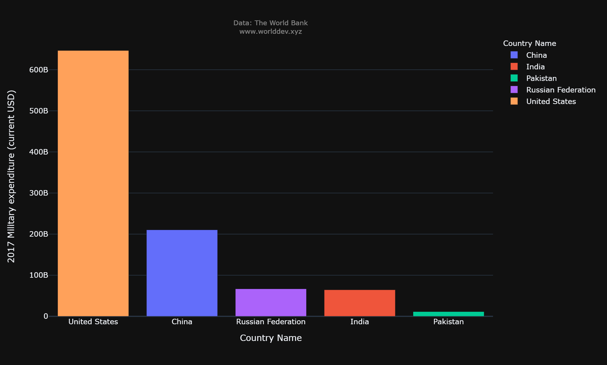

# Public Sector
The public sector is also part of the economy that maintains infrastructure, public transportation, public education, health care, and police and military services, among other things. In today's world, every nation devotes a greater percentage of its GDP on the Military. Military has a crucial role in protecting democratic and free market movements from both internal and external dangers by providing security assistance, training, and equipment. So lets investigate the publis sector. with this information, like based on its military spending and level of dependence on foreign countries when it comes to imports.

## Why is it important to you and/or to others?
Spending on the military makes the military stronger. This power makes people less likely to attack on country. If the country doesn't spend money on the military, its enemies may see it as an easy target. So, even though local defense spending may be more expensive, it creates more value in the form of stronger national security and less disruptions to trade and commerce. If a country's defense system is fully integrated, it can also help the economy.
## What questions do you have in mind and would like to answer?
Based on these indicators **Military expendicture (cureent USD), Military expenditure(% of GDP) and Arms imports( SIPRI trend indicator values)** i would like to do some research on: 
  * what percentage of GDP is being spent on military?
  * What percentage of Arms imports are Going on?
  * What are the Military expendicture for those countries?
  
## Where do you get the data and charts to help answer your questions (give references/credits)?

   * References: Wang, C. (2021). The world development explorer. Available from http://www.worlddev.xyz

## What process/step you use to analyze the situation/issue?

   * Countries: India, Pakisthan, Russian Federation, China, United States.

   * Time Period : 2007 - 2020
   
## IN 2017

The below bar chart shows how much countries spending on their Military expenditure (in terms of USD).

**OBSERVATIONS**
   * In 2019, the United States' military spending (in current dollars) is nearly $646 billion. When it comes to China  its military expenditure is 210 billion.          India's military expenditure (current USD) is 64.5 billion, and Russia's military expenditure (current USD) is 66.9 billion. Finally, Pakistan's military         expenditure in current USD is 11.4 billion.
  
  

The below bar chart shows how much countries spending on their  Military expenditure (in terms of USD).

hdbhjsdv dsvjhds sd svsd v v  v  dv v ds

## Time series Line Graph For Milatary expenditure (Current USD) for respective year

hdbhjbvsjdbvjsd vsdv jkds vj djs v dv  v vv b    b 

## The Below Scatter plot shows the relationship between Milatary expenditure (current USD) and Arms import (SIPRI trend indicator values)

hdbhjbvsjdbvjsd vsdv jkds vj djs v dv  v vv b    b 

## The Below Scatter plot shows the relationship between Milatary expenditure (% of GDP) and Milatary expenditure (current USD)

hdbhjbvsjdbvjsd vsdv jkds vj djs v dv  v vv b    b

## Latest trens by Line Graph

## Conclusion
bfjhdbvjds vvvvnbbbbwwwwwwwwwwwwwwwwwwwwwwwwwwwwwwwwwwwwfhffffffffffffffffffffffffff

