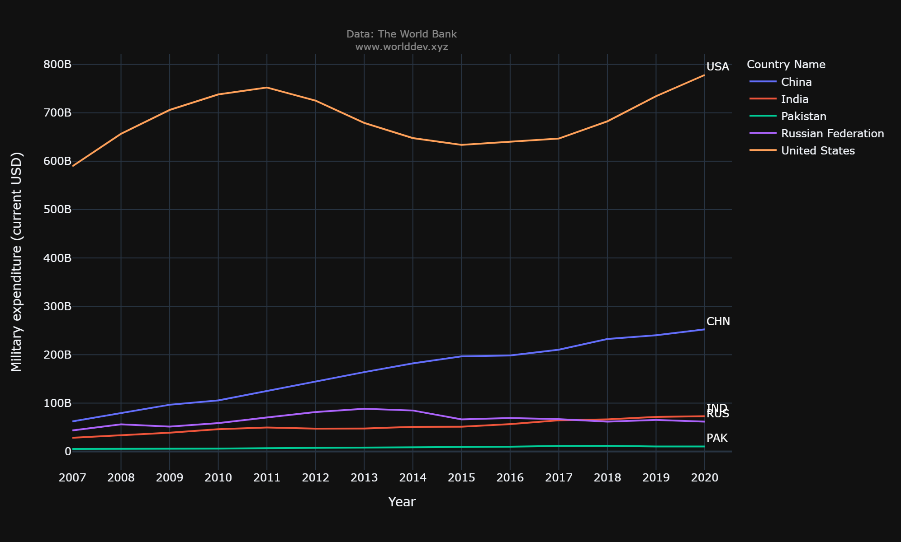
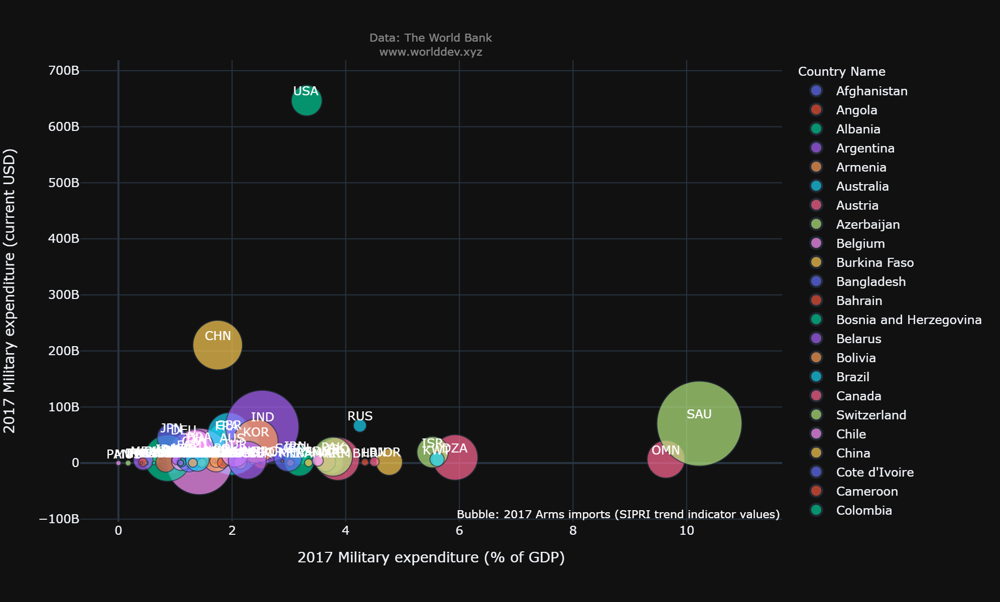

# Public Sector
The public sector is also part of the economy that maintains infrastructure, public transportation, public education, health care, and police and military services, among other things. In today's world, every nation devotes a greater percentage of its GDP on the Military. Military has a crucial role in protecting democratic and free market movements from both internal and external dangers by providing security assistance, training, and equipment. So lets investigate the publis sector. with this information, like based on its military spending and level of dependence on foreign countries when it comes to imports.

## Why is it important to you and/or to others?
Spending on the military makes the military stronger. This power makes people less likely to attack on country. If the country doesn't spend money on the military, its enemies may see it as an easy target. So, even though local defense spending may be more expensive, it creates more value in the form of stronger national security and less disruptions to trade and commerce. If a country's defense system is fully integrated, it can also help the economy.

## What questions do you have in mind and would like to answer?
Based on these indicators **Military expendicture (cureent USD), Military expenditure(% of GDP) and Arms imports( SIPRI trend indicator values)** i would like to do some research on: 
  * [what percentage of GDP is being spent on military?](#theme-installion)
  * [What percentage of Arms imports are Going on?](#theme-installion)
  * [What are the Military expendicture for those countries?](#theme-installion)
  
## Where do you get the data and charts to help answer your questions (give references/credits)?

   * References: Wang, C. (2021). The world development explorer. Available from http://www.worlddev.xyz

## What process/step you use to analyze the situation/issue?

   * [Countries: India, Pakisthan, Russian Federation, China, United States.](#theme-installion)

   * [Time Period : 2007 - 2020](#theme-installion)
   
## IN 2017

The below bar chart shows how much countries spending on their Military expenditure (in terms of USD).

**OBSERVATIONS**
   * In 2017, the United States' military spending (in current dollars) is nearly [$646 billion](#theme-installion). When it comes to China  its military expenditure is [210 billion](#theme-installion).          India's military expenditure (current USD) is [64.5 billion](#theme-installion), and Russia's military expenditure (current USD) is [66.9 billion](#theme-installion). Finally, Pakistan's military         expenditure in current USD is [11.4 billion](#theme-installion).
   
   * Here, the **U.S** Military expenditure is at the [top](#theme-installion) with [$646B](#theme-installion) and **PAKISTHAN** is at the [bottom](#theme-installion) with [$11.4B](#theme-installion).
  
  ## IN 2017
The below pie chart shows the **Arms imports( SIPRI trend indicator values)**

**OBSERVATIONS**
   * In 2017, India has the most imports of any country at [51.1%](#theme-installion), followed by China at [23.5%](#theme-installion), Pakistan at [14.7%](#theme-installion), the US at [9.06%](#theme-installion), and Russia at [1.63%](#theme-installion).
   
   * Here, the **INDIA** imports are at the [top](#theme-installion) with [51.1%](#theme-installion) and **RUSSIA** is at the [bottom](#theme-installion) with [1.63%](#theme-installion).
   

## Time series Line Graph For Milatary expenditure (Current USD) for respective year
The below line chart shows the trend for [2007 to 2020 on Military expenditure(current USD)](#theme-installion) .

**OBSERVATIONS**
   * **UNITED STATES** The line chart above shows how much money was spent on the military (in current USD) from [2007 to 2020](#theme-installion). As time goes from left to right, the United States has always been on top when comparing from all selected the countries. In [2007](#theme-installion), it spent [589.5 billion dollars](#theme-installion), and in [2011](#theme-installion), it spent [752 billion dollars](#theme-installion), which was the most ever. From [2012 to 2018](#theme-installion), the amount spent by the US slowly went down to about [682B](#theme-installion). In [2020](#theme-installion), it will be almost [778B](#theme-installion), which is the most the country has ever spent.
   
   * **CHINA** The line graph below depicts China's total military expenditures (in constant USD) from [2007 to 2020](#theme-installion). In the early stages, China spent [62.5 billion dollars](#theme-installion) from there, its spending gradually increased, and by [2016](#theme-installion), it had reached the level it had maintained in [2015: a total of 196.5 billion dollars](#theme-installion) and now the country that has spent the most money overall, at a total of [252.3 billion dollars](#theme-installion).
   
   * **RUSSIAN FEDERATION** From the line graph, you can see how much Russia spent on its military (in current USD) from [2007 to 2020](#theme-installion). As time goes from left to right, Russia has been in the [3 rd place](#theme-installion) among the selected countries. In [2007, it spent $62.1 billion](#theme-installion). Since then, the spending has gone up and down a bit, but between [2017 and 2020](#theme-installion), it dropped faster than India and spent nearly [$65.6 billion](#theme-installion). It kept going until [2020](#theme-installion) and ended up in [4th place](#theme-installion).
   
   * **INDIA** From [2007 to 2020](#theme-installion), the line graph shows how much India has spent on its military (in current USD). As you move from left to right, you can see that India was in [4 th place in 2007 with 28.4 B](#theme-installion), and then it started to grow slowly until [2017](#theme-installion). But in [2018](#theme-installion), it spent more than Russia, with [66.8 B, and by 2020](#theme-installion), it was in [3 rd place, with 72.8 B](#theme-installion).

   * **PAKISTHAN** This line graph shows Pakistan's military spending from [2007 to 2020 (in current USD)](#theme-installion). As time goes on, from left to right, Pakistan has always been in [5th place](#theme-installion). In [2007, it has spent 5.32 billion](#theme-installion), and it stayed there until [2020, when it had 10.8 billion](#theme-installion).
  
   
## The Below Scatter plot shows the relationship between Milatary expenditure (current USD) and Arms import (SIPRI trend indicator values)

**OBSERVATIONS**
   * This scatterplot shows that there is a direct relationship between Military spending (current USD) and Arms imports (SIPRI trend indicators values) across all countries. Out of all the countries, Saudi Arabia spent the most on importing arms, spending 105 billion dollars to buy 4.2 billion arms. India spends 100 billion dollars to bring in 3.2 billion arms. But China has spent 220 billion dollars on imports, which is less than SAU and IND. At the same time, the United States has spent 650 billion dollars on imports, but it only bought 0.7 billion arms and came in last place.
   
   * This scatterplot shows countries who are investing more they have very less imports for fire arms but especially a few countries like IND and SAU, EGY and AUS. 
   

## The Below Scatter plot shows the relationship between Milatary expenditure (% of GDP) and Milatary expenditure (current USD)

**OBSERVATIONS**
   * hdbhjbvsjdbvjsdvvvvvvvvvvvvvvvvvvvvvvvvvvvvvvvvvvvvvvvvvvvvvvvvvvvvvvvvvvvvvvvvvvvvvvvvvvvvvvvvvvvvvvvvvvvvvvvvvvvvvvvvvvvvvvvvvvvvvvvvvvvvvvv.
   
   * ggggggggggggggggggggggggggggggggggggggggggggggggggggggg.
  

## Conclusion
bfjhdbvjds vvvvnbbbbwwwwwwwwwwwwwwwwwwwwwwwwwwwwwwwwwwwwfhffffffffffffffffffffffffff

